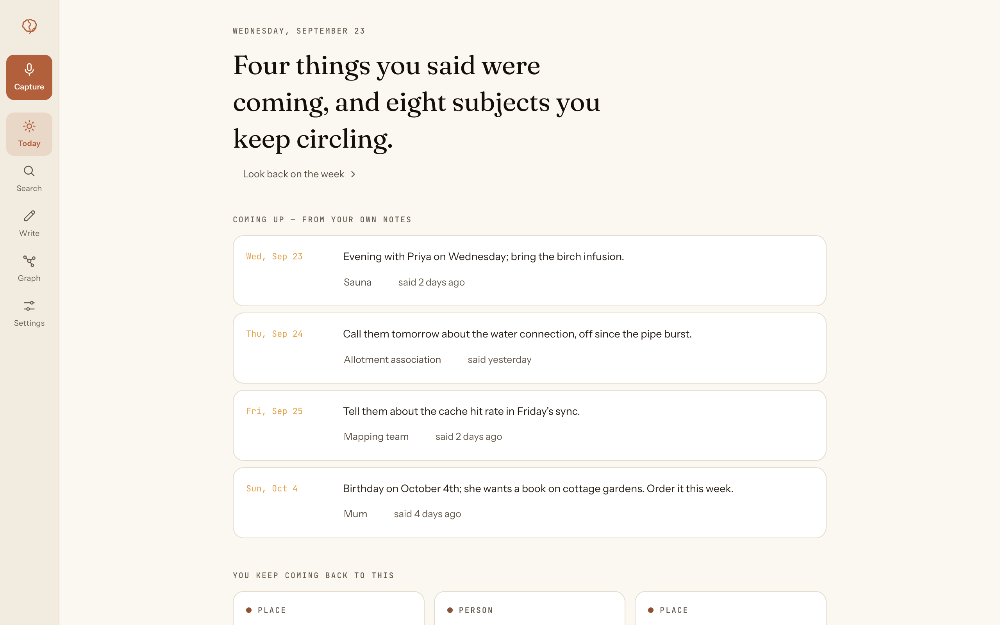
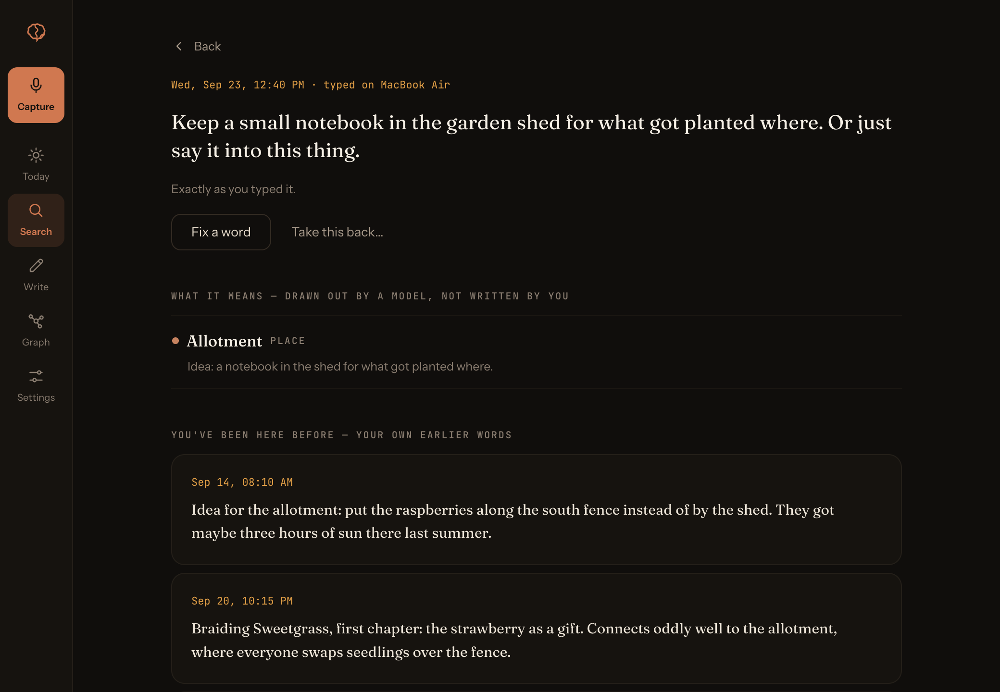
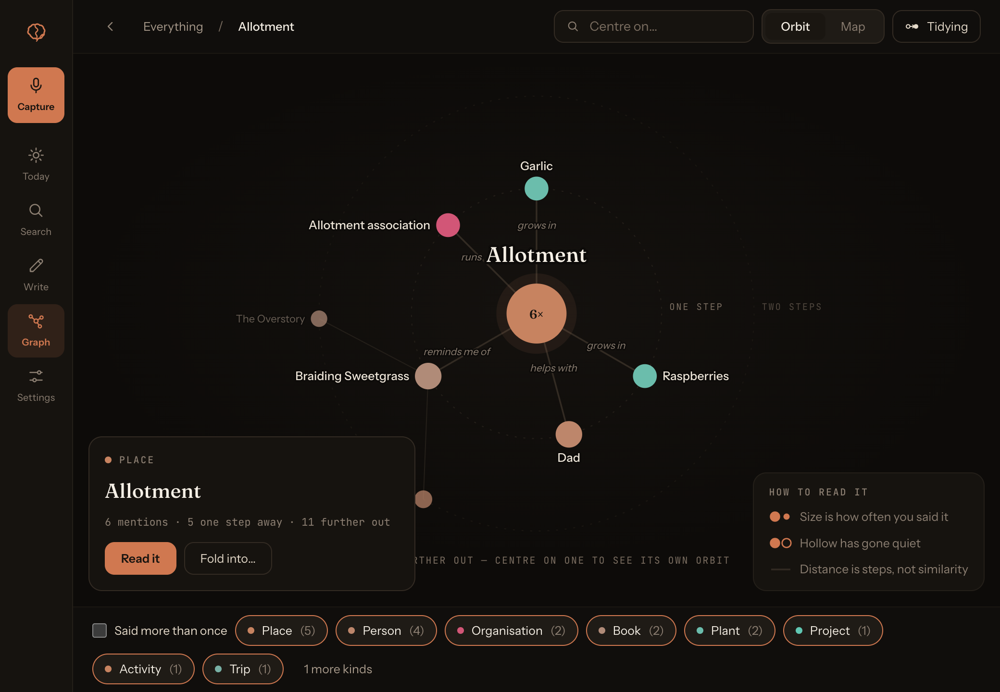
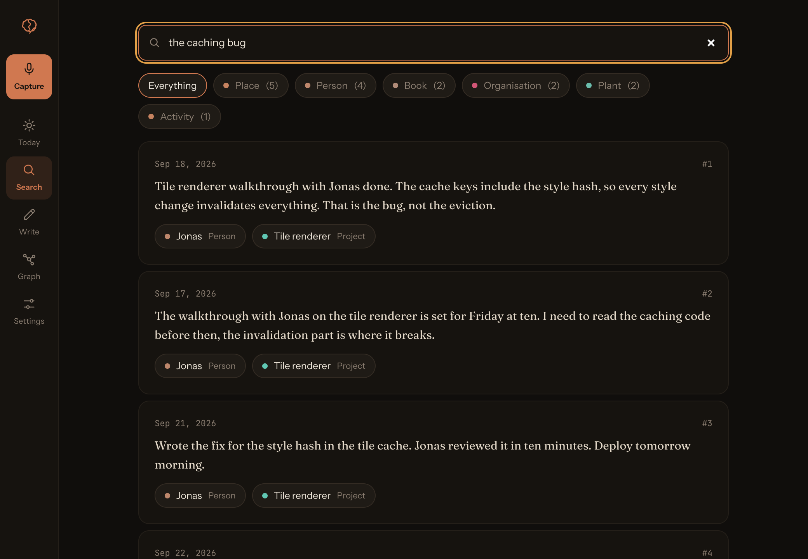
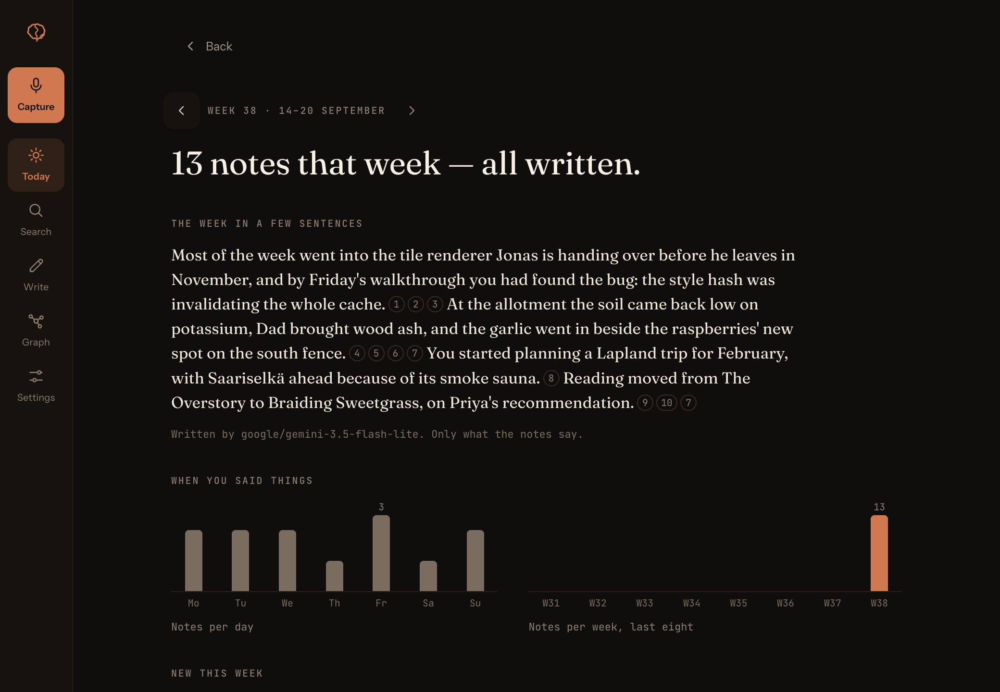

<p align="center">
  
</p>

<h1 align="center">Hippocampus</h1>

<p align="center">
  Say what is on your mind. Your Mac writes it down, word for word,<br>
  and shows you what you said about it before.
</p>

<p align="center">
  <a href="https://github.com/huulanka/hippocampus/releases/latest"></a>
  <a href="https://github.com/huulanka/hippocampus/actions/workflows/ci.yml"></a>
  
  
  <a href="LICENSE"></a>
</p>

<p align="center">
  <a href="#install">Install</a> &nbsp;·&nbsp;
  <a href="docs/how-it-works.md">How it works</a> &nbsp;·&nbsp;
  <a href="docs/README.md">Documentation</a>
</p>

<br>

<p align="center">
  <picture>
    <source media="(prefers-color-scheme: dark)" srcset="docs/assets/screenshots/today-dark.png">
    
  </picture>
</p>

<br>

Hippocampus is a memory for the things you think in passing. Press
<kbd>⌘</kbd><kbd>⇧</kbd><kbd>H</kbd>, say it, press it again. The recording
is transcribed on your Mac and kept exactly as you said it. A language model
then reads it and picks out the people, places, plans and dates, and writes
what it found into a separate layer that can never overwrite your words.

What makes it more than an archive is that it answers. Right after you
save a note, it shows you the earlier ones it belongs with, in your own
sentences. Over weeks, the people and topics you keep returning to grow
into a graph you can walk through.

## What it does

<table>
  <tr>
    <td width="33%" valign="top">
      <br>
      <b>Speak, don't type</b><br>
      One shortcut starts a recording, the same one stops it. Speech
      recognition runs on your Mac, and the audio never leaves it.
    </td>
    <td width="33%" valign="top">
      <br>
      <b>Your words stay yours</b><br>
      What you said is stored as said, for good. What the machine made of
      it sits beside it, and every conclusion points back to its source.
    </td>
    <td width="33%" valign="top">
      <br>
      <b>Echo</b><br>
      Each new note brings back the earlier notes closest to it. Your own
      sentences, never a summary of them.
    </td>
  </tr>
  <tr>
    <td width="33%" valign="top">
      <br>
      <b>A graph that fills itself</b><br>
      People, places and projects are pulled out of what you say and
      connected. Open it on everything, then pick one thing to orbit.
    </td>
    <td width="33%" valign="top">
      <br>
      <b>Touch ID to read</b><br>
      Reading your notes asks for Touch ID. Capturing does not, so a
      thought never has to wait behind a login.
    </td>
    <td width="33%" valign="top">
      <br>
      <b>Nothing gets lost</b><br>
      A note is on disk before the network is touched. A sleeping server
      or a dropped Wi-Fi only delays it.
    </td>
  </tr>
</table>

## A look around

<table>
  <tr>
    <td width="50%" valign="top">
      
      <br><sub><b>Echo.</b> A new note about the garden shed, and the earlier ones about the same patch of ground.</sub>
    </td>
    <td width="50%" valign="top">
      
      <br><sub><b>Graph.</b> One place at the centre, and what two weeks of notes connected to it.</sub>
    </td>
  </tr>
  <tr>
    <td width="50%" valign="top">
      
      <br><sub><b>Search.</b> By meaning and by exact word at once. The second and third never say “bug”.</sub>
    </td>
    <td width="50%" valign="top">
      
      <br><sub><b>The week.</b> Written up once a week, and every sentence points at the notes it came from.</sub>
    </td>
  </tr>
</table>

<sub>Every note in these screenshots is invented and was entered into a separate demo installation.</sub>

## Install

Hippocampus is a Mac app and a small backend you run yourself. The app
needs Apple Silicon and macOS 14 Sonoma or newer; the backend runs anywhere
Docker does.

**The app**, with Homebrew:

```sh
brew tap huulanka/hippocampus https://github.com/huulanka/hippocampus
brew trust --cask huulanka/hippocampus/hippocampus
brew install --cask hippocampus
xattr -dr com.apple.quarantine /Applications/Hippocampus.app
```

The `xattr` line is needed again after every upgrade. The build is not
notarised, and without it macOS refuses to open the app. For recording, the
app also needs the speech model (about 670 MB, once), which
`scripts/fetch-asr-model.sh` in this repository downloads. Typed notes work
without it.

**The backend**, with Docker:

```sh
git clone https://github.com/huulanka/hippocampus && cd hippocampus
cp .env.example .env   # put your OPENROUTER_API_KEY in here
docker compose up -d
```

Then open the app, go to **Settings → Backend** and enter the address,
`http://localhost:8080` if it runs on the same Mac.

[`docs/install.md`](docs/install.md) has the full story: why each of those
lines is there, running the backend on a NAS, and putting it behind
Cloudflare Access.

## What leaves your Mac

**Audio, never.** Recording and transcription happen on the Mac, and the
recording stays there.

**Text goes to your backend**, and from there to a language model through
[OpenRouter](https://openrouter.ai), which is how notes get their entities,
dates and relations. Requests are routed only to providers that keep no
copy. If you would rather no note text leaves your own hardware for Echo,
`HIPPOCAMPUS_RERANKER=bge` judges it locally instead, given a machine with
the power for it. The details are in [How it works](docs/how-it-works.md#echo).

## Status

Hippocampus is built by one person and used by that person every day. It
works and it releases often, but it is young: the app is Mac-only, the
build is not notarised, and what comes next is in the
[roadmap](docs/roadmap.md) (German). Issues and ideas are welcome.

## Documentation

- [Installing](docs/install.md): the app, the speech model, the backend
- [How it works](docs/how-it-works.md): why a note cannot be lost, how Echo chooses, who can read it
- [Developing](docs/development.md): running from source, the two installs, releases
- [Everything else](docs/README.md): product scope, design, and the architecture decisions behind all of it

## License

MIT, see [LICENSE](LICENSE).
